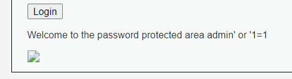

# Web Security

## 1.DVWA靶场

### 1.1 Brute Force

简介：暴力破解，一般就采用字典直接破解，或者分析网页代码直接采用SQL注入。在1.10/1.9版本的DVWA靶场中Brute Force基本都是直接可以使用BurpSuit抓包后使用工具爆破，基本没有什么难度。

(1)Low

- 一个简单的登录界面，第一反应就是在Low级别的可能都用不到工具，直接可以注入攻击，如图

- 再看看网页源代码时什么样的

  ```javascript
  <?php
  
  if( isset( $_GET[ 'Login' ] ) ) {
      // Get username
      $user = $_GET[ 'username' ];
  
      // Get password
      $pass = $_GET[ 'password' ];
      $pass = md5( $pass );
  
      // Check the database
      $query  = "SELECT * FROM `users` WHERE user = '$user' AND password = '$pass';";
      $result = mysqli_query($GLOBALS["___mysqli_ston"],  $query ) or die( '<pre>' . ((is_object($GLOBALS["___mysqli_ston"])) ? mysqli_error($GLOBALS["___mysqli_ston"]) : (($___mysqli_res = mysqli_connect_error()) ? $___mysqli_res : false)) . '</pre>' );
  
      if( $result && mysqli_num_rows( $result ) == 1 ) {
          // Get users details
          $row    = mysqli_fetch_assoc( $result );
          $avatar = $row["avatar"];
  
          // Login successful
          echo "<p>Welcome to the password protected area {$user}</p>";
          echo "";
      }
      else {
          // Login failed
          echo "<pre><br />Username and/or password incorrect.</pre>";
      }
  
      ((is_null($___mysqli_res = mysqli_close($GLOBALS["___mysqli_ston"]))) ? false : $___mysqli_res);
  }
  
  ?>
  ```

  不难发现，在Low中的网页代码几乎没有什么防御措施，甚至只是采用一个GET来获取用户名和密码，也就是说我们可以直接采用注入来实现攻击

- 构造一个可以绕过密码的注入

  ```sql
  admin' or '1=1
  ```

- 提交后注入成功，因此也不使用暴力破击（数据库可能有问题，图片没加载出来）
  
- 在Low级别中如果采用字典爆破的话反而会增加一些复杂性，具体情况如下
  - 字典的选择可能会增加爆破的时间，如果选择的字典极其巨大的话，爆破时间可能会很长
  - 在抓包后还要对代码进行解析，我觉得也很麻烦，还不如直接注入

(2)Medium

- 在Medium的js代码中就加入了简单的防SQL注入的内容，因此我们只能通过直接爆破了

  ```Javascript
  <?php
  
  if( isset( $_GET[ 'Login' ] ) ) {
      // Sanitise username input
      $user = $_GET[ 'username' ];
      $user = ((isset($GLOBALS["___mysqli_ston"]) && is_object($GLOBALS["___mysqli_ston"])) ? mysqli_real_escape_string($GLOBALS["___mysqli_ston"],  $user ) : ((trigger_error("[MySQLConverterToo] Fix the mysql_escape_string() call! This code does not work.", E_USER_ERROR)) ? "" : ""));
  
      // Sanitise password input
      $pass = $_GET[ 'password' ];
      $pass = ((isset($GLOBALS["___mysqli_ston"]) && is_object($GLOBALS["___mysqli_ston"])) ? mysqli_real_escape_string($GLOBALS["___mysqli_ston"],  $pass ) : ((trigger_error("[MySQLConverterToo] Fix the mysql_escape_string() call! This code does not work.", E_USER_ERROR)) ? "" : ""));
      $pass = md5( $pass );
  
      // Check the database
      $query  = "SELECT * FROM `users` WHERE user = '$user' AND password = '$pass';";
      $result = mysqli_query($GLOBALS["___mysqli_ston"],  $query ) or die( '<pre>' . ((is_object($GLOBALS["___mysqli_ston"])) ? mysqli_error($GLOBALS["___mysqli_ston"]) : (($___mysqli_res = mysqli_connect_error()) ? $___mysqli_res : false)) . '</pre>' );
  
      if( $result && mysqli_num_rows( $result ) == 1 ) {
          // Get users details
          $row    = mysqli_fetch_assoc( $result );
          $avatar = $row["avatar"];
  
          // Login successful
          echo "<p>Welcome to the password protected area {$user}</p>";
          echo "";
      }
      else {
          // Login failed
          sleep( 2 );
          echo "<pre><br />Username and/or password incorrect.</pre>";
      }
  
      ((is_null($___mysqli_res = mysqli_close($GLOBALS["___mysqli_ston"]))) ? false : $___mysqli_res);
  }
  
  ?>
  ```

  查询资料可发现，构造某种特殊的SQL注入也是可行的，但是相较于Low中的注入还是略微麻烦，因此为了省事，我直接采用抓包爆破

- 利用BurpSuit进行抓包，打开Sniper

(3)High

- 

### 1.2 Command Injection

简介：控制台注入是可以使用控制台命令进行攻击的

(1)Low

- 

(2)Medium

- 

(3)High

- 

### 1.3 CSRF

简介：

(1)Low

- 

(2)Medium

- 

(3)High

- 

### 1.4 File Inclusion

简介：

(1)Low

- 

(2)Medium

- 

(3)High

- 

### 1.5 File Upload

简介：

(1)Low

- 

(2)Medium

- 

(3)High

- 

课程笔记：

- Webshell以ASP、PHP、JSP等网页文件形式存在的一种执行命令环境，也称网页木马，分为大马（代码量大，功能齐全，但是不易隐藏）或小马（一句话木马等，隐蔽性很强）

### 1.6 Insecure CAPTCHA

简介：

(1)Low

- 

(2)Medium

- 

(3)High

- 

### 1.7 SQL Injection

简介：

(1)Low

- 

(2)Medium

- 

(3)High

- 

### 1.8 SQL Injection（Blind）

简介：

(1)Low

- 

(2)Medium

- 

(3)High

- 

### 1.9 Weak Session IDs

简介：

(1)Low

- 

(2)Medium

- 

(3)High

- 

### 1.10 XSS（DOM）

简介：

(1)Low

- 

(2)Medium

- 

(3)High

- 

### 1.11 XSS（Reflected）

简介：

(1)Low

- 

(2)Medium

- 

(3)High

- 

### 1.12 XSS（Stored）

简介：

(1)Low

- 

(2)Medium

- 

(3)High

- 

### 1.13 CSP Bypass

简介：

(1)Low

- 

(2)Medium

- 

(3)High

- 

### 1.14 JavaScript

简介：

(1)Low

- 

(2)Medium

- 

(3)High

- 
