# Computer Organization And Design

## 国内教材 计算机组成原理

## 第一部分 概论
### 1.计算机系统概论
#### 1.1 计算机系统简介
#####  1.1.1计算机的软硬件概念  

#####  		**硬件：**组成计算机的物理实体部分；软件：由人们事先编制的具有各类特殊功能的程序组成

**计算机系统的软件又可以分为两大类：**系统软件和应用软件

**系统软件：**又称系统程序，**主要用于管理整个计算机系统，监视服务，使系统资源得到合理调度，高效运行**；系统软件通常包括如下内容：标准程序库、语言处理程序（即将各层级语言编译为机器语言的程序）、操作系统、服务程序、数据库管理系统（DBMS）、网络软件等

**应用软件：**又称应用程序，是用户根据任务需要所编制的各种程序；包括科学计算器、数据处理程序、过程处理程序、事务管理程序等

##### 1.1.2 计算机系统的层次结构		

**计算机的一般解题过程：**用户编写高级语言程序——翻译成机器语言程序——输入目标计算机运行——得出结果

这个一个过程在计算机发展中得到了不断地细化，早期只有一个实际机器时，用户是直接编写二进制编码的程序让计算机运行的，即直接在实际机器上操作。在产生了符号化的变成语言后，可以理解为用户不再直接与计算机打交道，而是利用比机器语言高级的编程语言在一个虚拟机器上进行操作，而这个虚拟机器可以将用户的编程语言转换成实际机器能执行的机器语言

**根据上述内容，从时间顺序上产生了如下几种计算机系统**：

**两层次结构计算机系统**——随汇编语言产生

图示：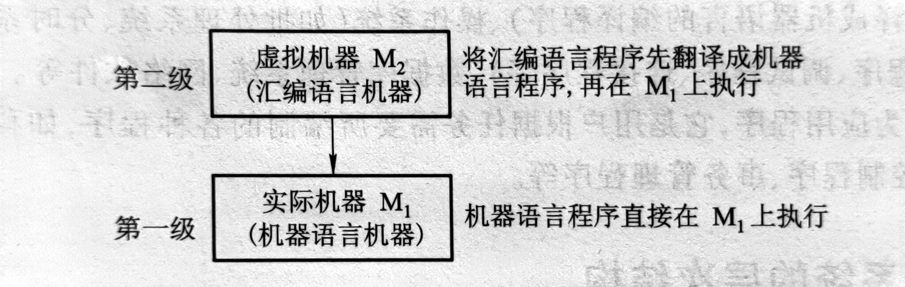

此时出现了ADD、SUB、MUL、DIV等表示加减乘除的符号，并用符号表示指令或数据所在的存储单元地址，让程序员不再使用繁琐复杂的二进制编码来编写程序。因为机器不能直接识别这些人类符号，所以实际机器向上发展出了虚拟机器，这些人类符号在虚拟机器上通过软件翻译成机器语言。

**缺点：虽然在目前的结构中看似已经有了较多的便利，但汇编语言仍然是一个面向机器的语言，甚至随着机器的发展，不同的机器还可能对应不同的汇编语言，这样仍是不利于计算机发展的。**

三层次结构计算机系统——随面向问题的高级语言产生（FORTRAN、BASIC、C等）

图示：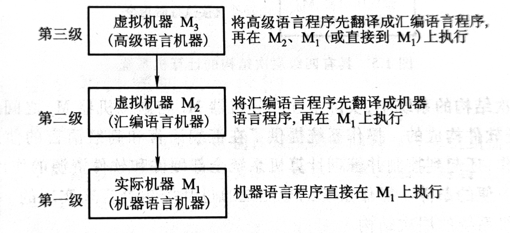

在汇编之上出现的高级语言是更加1贴近人类语言的一种编程语言，并且具有较强的通用性，同时这还规避了底层机器不同型号可能有不同机器指令的问题，使程序员不再去纠结于底层的各种繁琐的机器指令。这类语言的产生催生了在汇编虚拟机器之上的高级语言机器，用户只需使用高级语言在这一层进行交互，其他事留给汇编程序和汇编语言机器。

通常，将高级语言程序翻译成机器语言程序的软件成为翻译程序，一般分为两种：一种是编译程序，一种是解释程序：

**编译程序是将用户编写的高级语言程序（源程序）的全部语句一次性全部翻译成机器语言程序，然后再执行机器语言程序。**

**解释程序是阿静源程序的一条语句翻译成对应的一条机器语言，并立即执行这条语句，然后再翻译下一条执行下一条，如此反复**。

四层次结构计算机——随实际机器向下发展产生微程序机器而生

图示：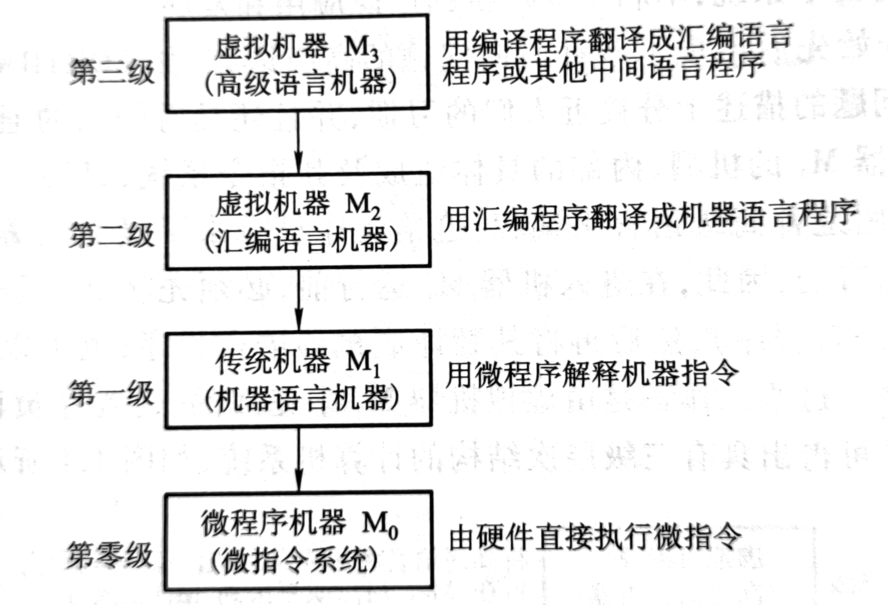

微程序机器的发展是传统实际机器向下发展的结果，这一变化使得每一条机器指令会产生一个对应的微程序，在传统机器执行机器指令时会自动进入与该指令对应的微程序执行。

其实这个微程序机器就是将传统机器进一步进行了分解，将功能细化

多层次结构计算机——在传统机器和虚拟机器中新增操作系统机器

图示：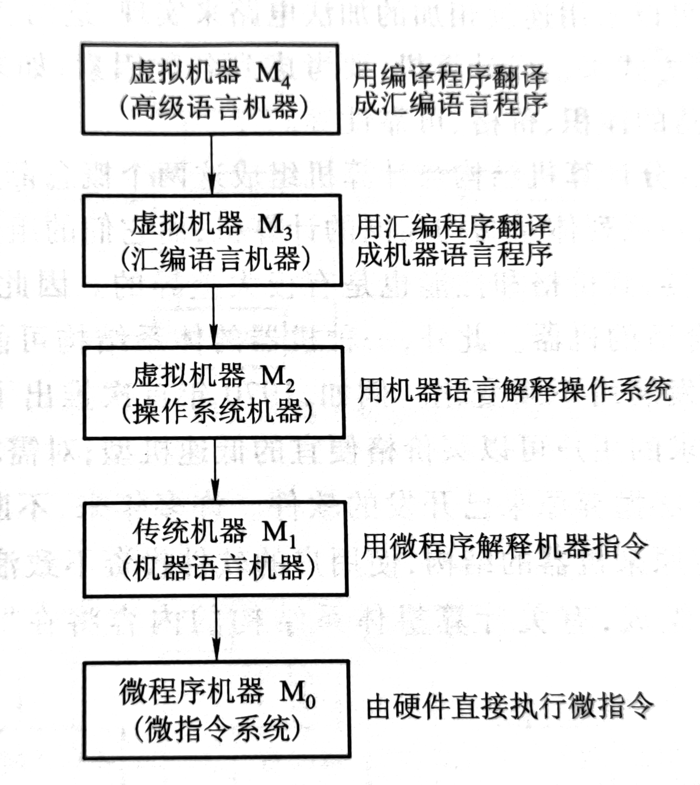

在四层次结构的基础上增加了操作系统机器，这个层级对计算机的全部硬件资源和软件资源进行管理，极大程度地方便了用户的操作，而操作系统的功能是通过其控制语言实现的

##### 1.1.3 计算机组成和计算机体系结构

**计算机体系结构：**通常是指能被程序员所见到的计算机系统的属性，即概念性的结构与功能特性：

- 计算机系统的属性通常是指用机器语言编程的程序员所看到的传统机器的属性
- 包括指令集、数据类型、存储器寻址技术、I/O机理等，大多是抽象属性
- 因为计算机多层次的特性，每一层次的程序员看到的属性各不相

**计算机组成：**是指如何实现计算机体系结构中所体现的属性，它包括了许多对程序员来说是透明的硬件细节：

举例：指令系统体现了机器的属性，这是属于计算机结构的问题。但是指令如何实现，即如何取指令、分析指令、取数操作、运算、运送结果等，都是计算机组成问题。

若是两台机器的指令系统完全相同，只能认为它们具有相同的结构，而这两台机器如何实现其指令的功能，**完全可以不同，即它们的组成方式可以不同。**

**组成和结构的不同可以理解为功能和实现方式的不同，同一个功能可以有不同的实现方式。一个机器具有某种功能，在实现上可以是有专门的物理电路实现，也可以是通过多种物理电路通过不同的调度方式实现**

#### 1.2 计算机的基本组成

##### 1.2.1 冯·诺伊曼计算机的特点

1. 计算机由运算器、存储器、控制器、输入设备和输出设备五大部件组成
2. 指令和数据以同等地位存放于存储器中，并可按地址寻访
3. 指令和数据均用二进制数表示
4. 指令由操作码和地址码组成，操作码表示操作的性质，地址吗用来表示操作数存放在存储器中的位置
5. 指令在存储器中按顺序存放
6. 机器以运算器为中心，输入输出设备与存储器见的数据传输通过运算器完成

##### 1.2.2 计算机的硬件框图

##### 		**冯诺依曼机**

 图示：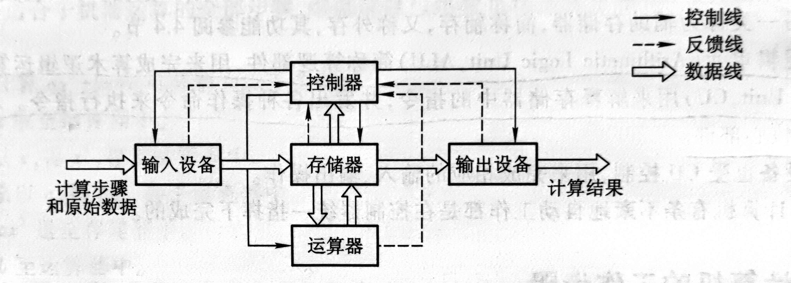

 **现代计算机结构框图及部件简介**

 图示：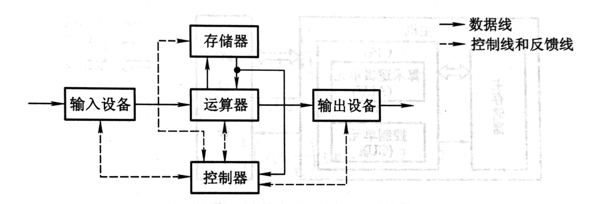

​	其中每个部件的功能如下：

​	运算器：用来完成算术运算和逻辑运算（ALU算术逻辑单元），运算的中间结果将暂存在运算器内

​	存储器：存放数据和程序

​	控制器：用来控制、指挥程序和数据的输入、运行以及处理运算结果（CU控制单元）

​	输入设备：用来将用户熟悉的信息转换为机器能够识别的信息形式，常见为键鼠

​	输出设备：将机器运算的结果转换为用户熟悉的信息形式，如打印机、显示器等

​	**五大部件在控制器的同一指挥下自动工作**

​	运算器和控制器在逻辑关系和电路关系上十分紧密，在大规模集成电路制作工艺出现后，这两个部件被集成在同一个芯片上，统称CPU。因此，现代计算机也可认为是三大部分组成，即CPU、I/O设备、主存储器（Main Memory，MM）。CPU和主存储器又称主机，I/O设备称为外设。

​	现代计算机的组成框图：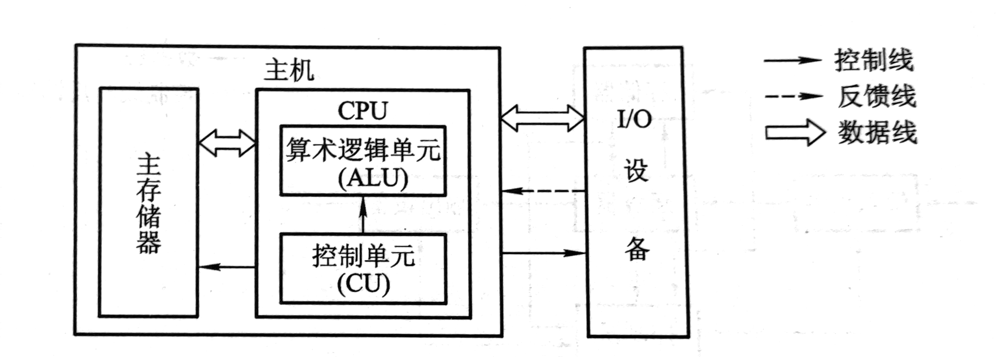

​	算术逻辑单元（Arithmetic Logic Unit ALU），简称逻辑部件，用来完成算术逻辑运算

​	控制单元（Control Unit CU）用来解释存储器中的指令，并发出各种操作命令来执行指令

##### 1.2.3 计算机的工作步骤

##### 	 	 **上机前的准备：**

- 建立数学模型
- 确定计算方法
- 编制解题程序

  **计算机工作过程**

-  取指令：PC——MAR——M——MDR——IR
-  分析：OP(IR)——CU
-  执行：AD(IR)——MAR——M——MDR——ACC

  计算机工作过程细化框图：

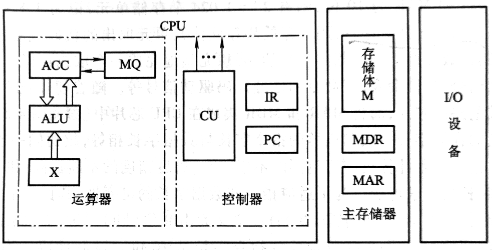

  主存储器包括存储体M、各种逻辑部件及控制电路

- 存储体又包括若干存储单元，每个存储单元又包含若干存储元件（称为存储基元、存储元）

- 每一个存储元件能寄存一位二进制码0或1

- 由此可见，每一个存储单元可以存储一串二进制代码，这串二进制代码称为一个存储字，这串二进制代码的长度称为存储字长

- 存储字长通常为2的幂次方，及8、16、32等

- 为了能够实现按地址访问的方式，主存储器中还包含两个寄存器MAR和MDR

  - MAR Memory Address Register，存储器地址寄存器，用来存放欲访问的存储单元地址，其位数对应存储单元的个数

  - MDR Memory  Data Register，存储器数据寄存器，用来存放从存储单元中取出的代码或准备存入某存储单元的代码，其位数与存储字长相等

- 运算器，其中包括三个寄存器（现代计算机内通常设有通用寄存器）和一个算术逻辑单元（ALU）

  - ACC（Accumulator）累加器
  - MQ（Multiplier-Quotient Register）乘商寄存器
  - X 操作数寄存器
  - 各寄存器所存放的操作数对应表：
  - 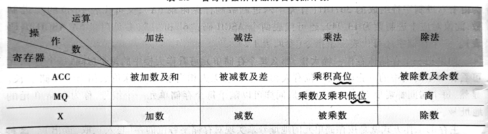

- 控制器，由程序计数器（Program Counter PC）、指令寄存器（Instruction Register IR）以及控制单元CU组成

  - PC：存放当前欲执行的指令的地址，与主存的MAR之间有一条直接通路，且具有自动加一的功能，即自动形成下一条指令的地址

  - IR：存放当前的指令，IR的内容来自主存的MDR

- I/O子系统包括各种I/O设备及其相应的接口，每一种I/O设备都由I/O接口与主机联系，它接受CU发出的各种控制命令，并完成相应的操作

#### 1.3 计算机硬件的主要技术指标

##### 1.3.1 机器字长

机器字长是指CPU一次能处理数据的位数，通常与CPU的寄存器位数有关

字长越长，数的表示范围越大，精度也就越高

机器字长会影响计算机的运算速度

##### 1.3.2 主存容量

存储器的容量应该包括主存容量和辅存容量，主存容量是指主存中存放二进制代码的总位数，即

- 存储容量=存储单元个数*存储字长

##### 1.3.3 运算速度

运算速度与机器主频、执行操作的类型、主存速度等因素有关，一般采用吉普森法计算计算机的运算速度，即
											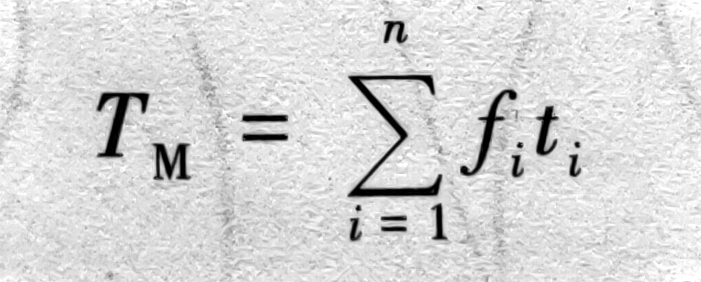

现代机器的运算速度采用单位时间内执行指令的平均条数来衡量，并用**MISP（Million Instruction Per Second，百万条指令每秒）**作为计量单位

也可以采用**CPI（Cycle Per Instruction）**即执行一条指令所需的时钟周期间（机器主频的倒数）

还可以采用**FLOPS（Floating Point Operation Per Second，浮点运算次每秒）**

## 第二部分 计算机系统的硬件结构

### 3.系统总线

#### 3.1 总线的基本概念

计算机系统五大部件之间有两种互连方式：

- 分散连接——各部件之间使用单独的线连接；但是由于设备的增加，分散连接时的电路设计变得极其困难，且扩展性和灵活性很差，因此现代设备基本上不采用这种连接方式
- 总线连接——将各个部件连接到一组公共信息传输线上

总线是连接多个部件的信息传输线，**是个部件共享的传输介质**，但总线也是有诸多需要考虑的问题：

- 多个设备在通信时的信号冲突
- 总线宽度（及总线的通路总数，单位时间能传输多少位的二进制数）
- 总线结构（对机器运行效率产生怎样的影响）

#### 3.2 总线的分类

总线的分类可以很多，按照传输方式可分为并行总线和串行总线；按照数据宽度可分为8位、16位、32位、64位总线；按照使用范围分为计算机总线、测控总线、网络通信总线等。根据课本描述，在此只记录的三类总线

##### 3.2.1 片内总线

**片内总线**是指芯片内部的总线，如在CPU芯片内部，寄存器与寄存器之间、寄存器与逻辑单元ALU之间都有片内总线相连

##### 3.2.2 系统总线

系统总线是指CPU、主存、I/O设备各大部件之间的信息传输线，通常都安放在主板或各插件版上，又称板级总线或板间总线

系统总线又能细分为三类：

- 1.数据总线
  - 数据总线是用来传输各部件之间的数据信息，是双向传输总线，其位数与机器字长和存储字长有关，通常为8、16、32
  - 数据总线的位数称为数据总线宽度，是衡量系统性能的重要参数

- 2.地址总线
  - 地址总线主要用于指出数据总线上源数据或目的数据在主存储单元的地址或I/O设备的地址
  - 举例：从存储器中读取一个数据，CPU要将此数据所在存储单元的地址送到地址线上；将某数据经I/O设备输出，则CPUI除了将数据送到地址总线外，还需要将该输出设备的地址送到地址总线上
  - 地址总线上的代码时用来指明CPU欲访问的存储单元和I/O端口的地址，由CPU输出，单向传输
  - 地址总线的宽度与存储单元的个数相关，假如地址总线为20根，那内存单元就是$2^{20}$个

- 3.控制总线
  - 由于数据总线、地址总线都是被挂在总线上的所有部件所共享，如何使各部件能在不同时刻占有总线使用权，这些操作通过控制总线完成
  - 相关控制信号：
    - 时钟：用来同步各种操作
    - 复位：初始化所有部件
    - 总线请求：表示某部件需获得总线使用权
    - 总线允许：表示需要获得总线使用权的部件已获得了控制权
    - 中断请求：表示某部件提出中断请求
    - 中断响应：表示中断请求已被接收
    - 存储器写：将数据总线上的数据写至存储器的指定地址单元内
    - 存储器读：将指定存储单元中的数据读到数据总线上
    - I/O读：从指定的I/O端口将数据读到数据总线上
    - I/O写：将数据总线上的数据输出到指定的I/O端口内
    - 传输响应：表示数据已被接收，或已将数据送至数据总线上

##### 3.2.3 通信总线

按传输方式分，可分为串行通信和并行通信

- 串行通信：数据在单条1位宽的传输线上，一位一位地按顺序分时传输，1字节数据要从低位到高位逐位传输
- 并行通信：数据在多条并行1位宽的传输线上，同时由源传输到目的地

并行通信适用于近距离的数据传输，串行通信适宜长距离输送，同时串行和并行通信的数据传送速率都与距离成反比

#### 3.3 总线特性及性能指标

##### 3.3.1 总线特性

- 机械特性：机械特性是指总线在机械连接方式上的性能，如插头与插座使用标准等
- 电气特性：电气特性是指总线的每一根传输线上信号的传递方向和有效的电平范围
- 功能特性：功能特性是指总线中每根传输线的功能
- 时间特性：时间特性是指总线中任一根线在什么时间内有效

##### 3.3.2 总线性能指标

- 总线宽度
  - 通常是指数据总线的根数，用bit(位)表示，如8，16，32，64位等
- 总线带宽
  - 总线带宽是总线的传输速率，即单位时间内总线上传输数据的位数，一般用秒字节数衡量，单位可用MBps(兆字节每秒)
- 时间同步/异步
  - 总线上的数据与时钟同步工作的总线称为同步总线，与时钟不同步工作的总线为异步总线
- 总线复用：一条信号线上分时传送两种信号
- 信号线数：地址总线、数据总线和控制总线三种总线的总和
- 总线控制方式：包括突发工作，自动配置、仲裁方式、逻辑方式、计数方式等
- 其他指标：如负载能力、电源电压、总线宽度能否扩展等

总线性能图表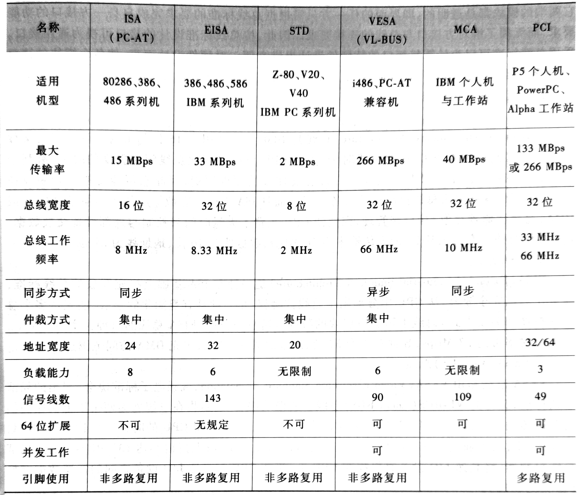

##### 3.3.3 总线标准

所谓总线标准，即系统与各模块、模块与模块之间的一个互联的标准界面，目前主流的几种总线标准如下：

- ISA总线
- EISA总线
- VESA总线
- PCI总线
- AGP总线
- RS-232C总线
- USB总线

#### 3.4 总线结构

##### 3.4.1 单总线结构

##### 3.4.2 多总线结构

##### 3.4.3 总线结构举例

#### 3.5 总线控制

##### 3.5.1 总线判优控制

##### 3.5.2 总线通信控制

### 4.存储器

#### 4.1 概述

#### 4.2 主存储器

#### 4.3 高速缓冲存储器

#### 4.4 辅助存储器

### 5.输入输出系统

#### 5.1 概述

#### 5.2 I/O设备

#### 5.3 I/O接口

#### 5.4 程序查询方式

#### 5.5 程序中断方式

#### 5.6 DMA方式

## 第三部分 中央处理器

### 6.计算机的运算方法

### 7.指令系统

### 8.CPU的结构和功能

## 第四部分 控制单元

### 9.控制单元的功能

#### 9.1 微操作命令的分析

##### 9.1.1 取指周期

##### 9.1.2 间址周期

##### 9.1.3 执行周期

##### 9.1.4 中断周期

#### 9.2 控制单元的功能

##### 9.2.1 控制单元的外特性

##### 9.2.2 控制信号举例

##### 9.2.3 多级时序系统

##### 9.2.4 控制方式

##### 9.2.5 多级时序系统实例分析

### 10.控制单元的设计

#### 10.1 组合逻辑设计

##### 10.1.1 组合逻辑控制单元框图

##### 10.1.2 微操作的节拍安排

##### 10.1.3 组合逻辑设计步骤

#### 10.2微程序设计

##### 10.2.1 微程序设计思想的产生

##### 10.2.2 微程序控制单元框图及工作原理

##### 10.2.3 微指令的编码方式

##### 10.2.4 微指令序列的地址形成

##### 10.2.5 微指令格式

##### 10.2.6 静态微程序设计和动态微程序设计

##### 10.2.7 毫微程序设计

##### 10.2.8 串行微程序控制和并行微程序控制

##### 10.2.9 微程序设计举例

## 国外资料 计算机组成与设计——硬件/软件接口
## 第一章 计算机抽象及相关技术
## 第二章 指令：计算机的语言
## 第三章 计算机的算术运算
## 第四章 处理器
## 第五章 大而快：层次化存储
## 第六章 并行处理器：从客户端到云