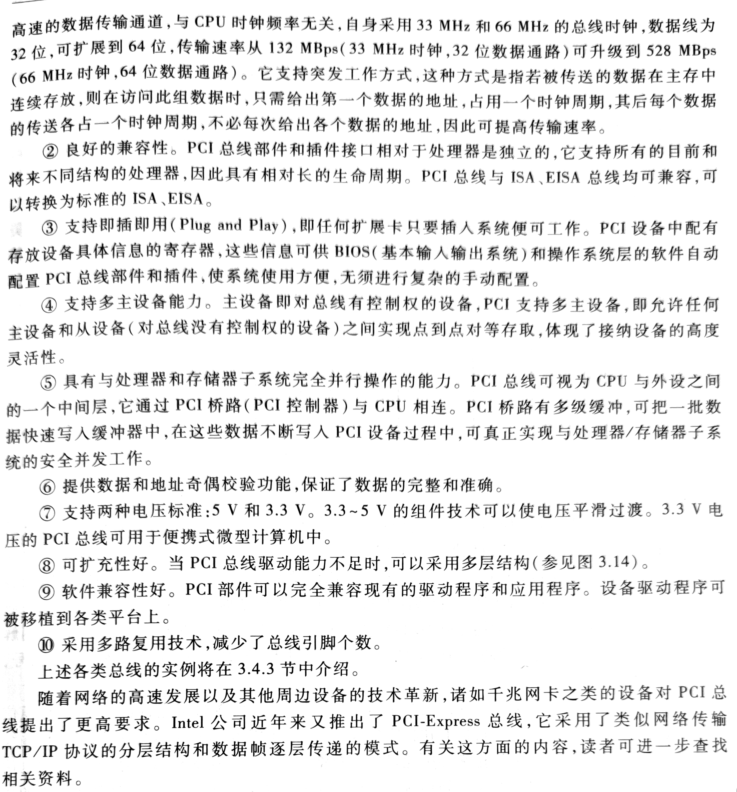
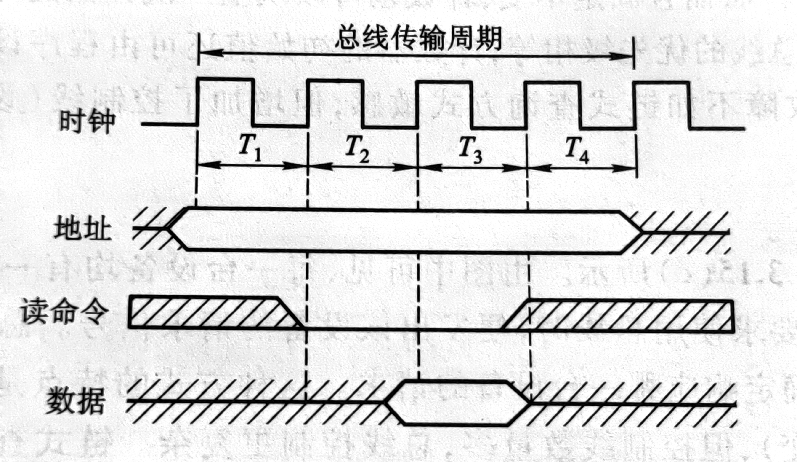
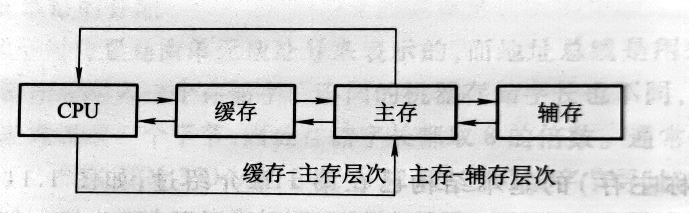

# Computer Organization And Design

## 国内教材 计算机组成原理

## 第一部分 概论
### 1.计算机系统概论
#### 1.1 计算机系统简介
#####  1.1.1计算机的软硬件概念  

#####  		**硬件：**组成计算机的物理实体部分；软件：由人们事先编制的具有各类特殊功能的程序组成

**计算机系统的软件又可以分为两大类：**系统软件和应用软件

**系统软件：**又称系统程序，**主要用于管理整个计算机系统，监视服务，使系统资源得到合理调度，高效运行**；系统软件通常包括如下内容：标准程序库、语言处理程序（即将各层级语言编译为机器语言的程序）、操作系统、服务程序、数据库管理系统（DBMS）、网络软件等

**应用软件：**又称应用程序，是用户根据任务需要所编制的各种程序；包括科学计算器、数据处理程序、过程处理程序、事务管理程序等

##### 1.1.2 计算机系统的层次结构		

**计算机的一般解题过程：**用户编写高级语言程序——翻译成机器语言程序——输入目标计算机运行——得出结果

这个一个过程在计算机发展中得到了不断地细化，早期只有一个实际机器时，用户是直接编写二进制编码的程序让计算机运行的，即直接在实际机器上操作。在产生了符号化的变成语言后，可以理解为用户不再直接与计算机打交道，而是利用比机器语言高级的编程语言在一个虚拟机器上进行操作，而这个虚拟机器可以将用户的编程语言转换成实际机器能执行的机器语言

**根据上述内容，从时间顺序上产生了如下几种计算机系统**：

**两层次结构计算机系统**——随汇编语言产生

图示：

此时出现了ADD、SUB、MUL、DIV等表示加减乘除的符号，并用符号表示指令或数据所在的存储单元地址，让程序员不再使用繁琐复杂的二进制编码来编写程序。因为机器不能直接识别这些人类符号，所以实际机器向上发展出了虚拟机器，这些人类符号在虚拟机器上通过软件翻译成机器语言。

**缺点：虽然在目前的结构中看似已经有了较多的便利，但汇编语言仍然是一个面向机器的语言，甚至随着机器的发展，不同的机器还可能对应不同的汇编语言，这样仍是不利于计算机发展的。**

三层次结构计算机系统——随面向问题的高级语言产生（FORTRAN、BASIC、C等）

图示：

在汇编之上出现的高级语言是更加1贴近人类语言的一种编程语言，并且具有较强的通用性，同时这还规避了底层机器不同型号可能有不同机器指令的问题，使程序员不再去纠结于底层的各种繁琐的机器指令。这类语言的产生催生了在汇编虚拟机器之上的高级语言机器，用户只需使用高级语言在这一层进行交互，其他事留给汇编程序和汇编语言机器。

通常，将高级语言程序翻译成机器语言程序的软件成为翻译程序，一般分为两种：一种是编译程序，一种是解释程序：

**编译程序是将用户编写的高级语言程序（源程序）的全部语句一次性全部翻译成机器语言程序，然后再执行机器语言程序。**

**解释程序是阿静源程序的一条语句翻译成对应的一条机器语言，并立即执行这条语句，然后再翻译下一条执行下一条，如此反复**。

四层次结构计算机——随实际机器向下发展产生微程序机器而生

图示：

微程序机器的发展是传统实际机器向下发展的结果，这一变化使得每一条机器指令会产生一个对应的微程序，在传统机器执行机器指令时会自动进入与该指令对应的微程序执行。

其实这个微程序机器就是将传统机器进一步进行了分解，将功能细化

多层次结构计算机——在传统机器和虚拟机器中新增操作系统机器

图示：

在四层次结构的基础上增加了操作系统机器，这个层级对计算机的全部硬件资源和软件资源进行管理，极大程度地方便了用户的操作，而操作系统的功能是通过其控制语言实现的

##### 1.1.3 计算机组成和计算机体系结构

**计算机体系结构：**通常是指能被程序员所见到的计算机系统的属性，即概念性的结构与功能特性：

- 计算机系统的属性通常是指用机器语言编程的程序员所看到的传统机器的属性
- 包括指令集、数据类型、存储器寻址技术、I/O机理等，大多是抽象属性
- 因为计算机多层次的特性，每一层次的程序员看到的属性各不相

**计算机组成：**是指如何实现计算机体系结构中所体现的属性，它包括了许多对程序员来说是透明的硬件细节：

举例：指令系统体现了机器的属性，这是属于计算机结构的问题。但是指令如何实现，即如何取指令、分析指令、取数操作、运算、运送结果等，都是计算机组成问题。

若是两台机器的指令系统完全相同，只能认为它们具有相同的结构，而这两台机器如何实现其指令的功能，**完全可以不同，即它们的组成方式可以不同。**

**组成和结构的不同可以理解为功能和实现方式的不同，同一个功能可以有不同的实现方式。一个机器具有某种功能，在实现上可以是有专门的物理电路实现，也可以是通过多种物理电路通过不同的调度方式实现**

#### 1.2 计算机的基本组成

##### 1.2.1 冯·诺伊曼计算机的特点

1. 计算机由运算器、存储器、控制器、输入设备和输出设备五大部件组成
2. 指令和数据以同等地位存放于存储器中，并可按地址寻访
3. 指令和数据均用二进制数表示
4. 指令由操作码和地址码组成，操作码表示操作的性质，地址吗用来表示操作数存放在存储器中的位置
5. 指令在存储器中按顺序存放
6. 机器以运算器为中心，输入输出设备与存储器见的数据传输通过运算器完成

##### 1.2.2 计算机的硬件框图

##### 		**冯诺依曼机**

 图示：

 **现代计算机结构框图及部件简介**

 图示：

​	其中每个部件的功能如下：

​	运算器：用来完成算术运算和逻辑运算（ALU算术逻辑单元），运算的中间结果将暂存在运算器内

​	存储器：存放数据和程序

​	控制器：用来控制、指挥程序和数据的输入、运行以及处理运算结果（CU控制单元）

​	输入设备：用来将用户熟悉的信息转换为机器能够识别的信息形式，常见为键鼠

​	输出设备：将机器运算的结果转换为用户熟悉的信息形式，如打印机、显示器等

​	**五大部件在控制器的同一指挥下自动工作**

​	运算器和控制器在逻辑关系和电路关系上十分紧密，在大规模集成电路制作工艺出现后，这两个部件被集成在同一个芯片上，统称CPU。因此，现代计算机也可认为是三大部分组成，即CPU、I/O设备、主存储器（Main Memory，MM）。CPU和主存储器又称主机，I/O设备称为外设。

​	现代计算机的组成框图：

​	算术逻辑单元（Arithmetic Logic Unit ALU），简称逻辑部件，用来完成算术逻辑运算

​	控制单元（Control Unit CU）用来解释存储器中的指令，并发出各种操作命令来执行指令

##### 1.2.3 计算机的工作步骤

##### 	 	 **上机前的准备：**

- 建立数学模型
- 确定计算方法
- 编制解题程序

  **计算机工作过程**

-  取指令：PC——MAR——M——MDR——IR
-  分析：OP(IR)——CU
-  执行：AD(IR)——MAR——M——MDR——ACC

  计算机工作过程细化框图：

  主存储器包括存储体M、各种逻辑部件及控制电路

- 存储体又包括若干存储单元，每个存储单元又包含若干存储元件（称为存储基元、存储元）

- 每一个存储元件能寄存一位二进制码0或1

- 由此可见，每一个存储单元可以存储一串二进制代码，这串二进制代码称为一个存储字，这串二进制代码的长度称为存储字长

- 存储字长通常为2的幂次方，及8、16、32等

- 为了能够实现按地址访问的方式，主存储器中还包含两个寄存器MAR和MDR

  - MAR Memory Address Register，存储器地址寄存器，用来存放欲访问的存储单元地址，其位数对应存储单元的个数

  - MDR Memory  Data Register，存储器数据寄存器，用来存放从存储单元中取出的代码或准备存入某存储单元的代码，其位数与存储字长相等

- 运算器，其中包括三个寄存器（现代计算机内通常设有通用寄存器）和一个算术逻辑单元（ALU）

  - ACC（Accumulator）累加器
  - MQ（Multiplier-Quotient Register）乘商寄存器
  - X 操作数寄存器
  - 各寄存器所存放的操作数对应表：
  - 

- 控制器，由程序计数器（Program Counter PC）、指令寄存器（Instruction Register IR）以及控制单元CU组成

  - PC：存放当前欲执行的指令的地址，与主存的MAR之间有一条直接通路，且具有自动加一的功能，即自动形成下一条指令的地址

  - IR：存放当前的指令，IR的内容来自主存的MDR

- I/O子系统包括各种I/O设备及其相应的接口，每一种I/O设备都由I/O接口与主机联系，它接受CU发出的各种控制命令，并完成相应的操作

#### 1.3 计算机硬件的主要技术指标

##### 1.3.1 机器字长

机器字长是指CPU一次能处理数据的位数，通常与CPU的寄存器位数有关

字长越长，数的表示范围越大，精度也就越高

机器字长会影响计算机的运算速度

##### 1.3.2 主存容量

存储器的容量应该包括主存容量和辅存容量，主存容量是指主存中存放二进制代码的总位数，即

- 存储容量=存储单元个数*存储字长

##### 1.3.3 运算速度

运算速度与机器主频、执行操作的类型、主存速度等因素有关，一般采用吉普森法计算计算机的运算速度，即
											

现代机器的运算速度采用单位时间内执行指令的平均条数来衡量，并用**MISP（Million Instruction Per Second，百万条指令每秒）**作为计量单位

也可以采用**CPI（Cycle Per Instruction）**即执行一条指令所需的时钟周期间（机器主频的倒数）

还可以采用**FLOPS（Floating Point Operation Per Second，浮点运算次每秒）**

## 第二部分 计算机系统的硬件结构

### 3.系统总线

#### 3.1 总线的基本概念

计算机系统五大部件之间有两种互连方式：

- 分散连接——各部件之间使用单独的线连接；但是由于设备的增加，分散连接时的电路设计变得极其困难，且扩展性和灵活性很差，因此现代设备基本上不采用这种连接方式
- 总线连接——将各个部件连接到一组公共信息传输线上

总线是连接多个部件的信息传输线，**是个部件共享的传输介质**，但总线也是有诸多需要考虑的问题：

- 多个设备在通信时的信号冲突
- 总线宽度（及总线的通路总数，单位时间能传输多少位的二进制数）
- 总线结构（对机器运行效率产生怎样的影响）

#### 3.2 总线的分类

总线的分类可以很多，按照传输方式可分为并行总线和串行总线；按照数据宽度可分为8位、16位、32位、64位总线；按照使用范围分为计算机总线、测控总线、网络通信总线等。根据课本描述，在此只记录的三类总线

##### 3.2.1 片内总线

**片内总线**是指芯片内部的总线，如在CPU芯片内部，寄存器与寄存器之间、寄存器与逻辑单元ALU之间都有片内总线相连

##### 3.2.2 系统总线

系统总线是指CPU、主存、I/O设备各大部件之间的信息传输线，通常都安放在主板或各插件版上，又称板级总线或板间总线

系统总线又能细分为三类：

- 1.数据总线
  - 数据总线是用来传输各部件之间的数据信息，是双向传输总线，其位数与机器字长和存储字长有关，通常为8、16、32
  - 数据总线的位数称为数据总线宽度，是衡量系统性能的重要参数

- 2.地址总线
  - 地址总线主要用于指出数据总线上源数据或目的数据在主存储单元的地址或I/O设备的地址
  - 举例：从存储器中读取一个数据，CPU要将此数据所在存储单元的地址送到地址线上；将某数据经I/O设备输出，则CPUI除了将数据送到地址总线外，还需要将该输出设备的地址送到地址总线上
  - 地址总线上的代码时用来指明CPU欲访问的存储单元和I/O端口的地址，由CPU输出，单向传输
  - 地址总线的宽度与存储单元的个数相关，假如地址总线为20根，那内存单元就是$2^{20}$个

- 3.控制总线
  - 由于数据总线、地址总线都是被挂在总线上的所有部件所共享，如何使各部件能在不同时刻占有总线使用权，这些操作通过控制总线完成
  - 相关控制信号：
    - 时钟：用来同步各种操作
    - 复位：初始化所有部件
    - 总线请求：表示某部件需获得总线使用权
    - 总线允许：表示需要获得总线使用权的部件已获得了控制权
    - 中断请求：表示某部件提出中断请求
    - 中断响应：表示中断请求已被接收
    - 存储器写：将数据总线上的数据写至存储器的指定地址单元内
    - 存储器读：将指定存储单元中的数据读到数据总线上
    - I/O读：从指定的I/O端口将数据读到数据总线上
    - I/O写：将数据总线上的数据输出到指定的I/O端口内
    - 传输响应：表示数据已被接收，或已将数据送至数据总线上

##### 3.2.3 通信总线

按传输方式分，可分为串行通信和并行通信

- 串行通信：数据在单条1位宽的传输线上，一位一位地按顺序分时传输，1字节数据要从低位到高位逐位传输
- 并行通信：数据在多条并行1位宽的传输线上，同时由源传输到目的地

并行通信适用于近距离的数据传输，串行通信适宜长距离输送，同时串行和并行通信的数据传送速率都与距离成反比

#### 3.3 总线特性及性能指标

##### 3.3.1 总线特性

- 机械特性：机械特性是指总线在机械连接方式上的性能，如插头与插座使用标准等
- 电气特性：电气特性是指总线的每一根传输线上信号的传递方向和有效的电平范围
- 功能特性：功能特性是指总线中每根传输线的功能
- 时间特性：时间特性是指总线中任一根线在什么时间内有效

##### 3.3.2 总线性能指标

- 总线宽度
  - 通常是指数据总线的根数，用bit(位)表示，如8，16，32，64位等
- 总线带宽
  - 总线带宽是总线的传输速率，即单位时间内总线上传输数据的位数，一般用秒字节数衡量，单位可用MBps(兆字节每秒)
- 时间同步/异步
  - 总线上的数据与时钟同步工作的总线称为同步总线，与时钟不同步工作的总线为异步总线
- 总线复用：一条信号线上分时传送两种信号
- 信号线数：地址总线、数据总线和控制总线三种总线的总和
- 总线控制方式：包括突发工作，自动配置、仲裁方式、逻辑方式、计数方式等
- 其他指标：如负载能力、电源电压、总线宽度能否扩展等

总线性能图表

##### 3.3.3 总线标准

所谓总线标准，即系统与各模块、模块与模块之间的一个互联的标准界面，目前主流的几种总线标准如下：

- ISA总线
  - IBM为全16位CPU推出的总线，又称AT总线，采用独立于CPU的总线时钟，因此CPU可以采用更高频率的时钟
  - 但是不支持总线仲裁的硬件逻辑，所以不支持多台主设备系统
  - ISA总线的时钟频率为8 MHz，最大传输速率为16 MBps，数据线为16位，地址总线为24位

- EISA总线
  - 基于ISA总线扩充开放的总线标准，与ISA可以完全兼容，从CPU中分离出了总线控制权，是一种具有智能化的总线
  - 支持多个总线主控制器和突发方式传输
  - 时钟频率8 MHz，最大传输率可达33 MBps，数据总线为32位，地址总线为32位，扩充DMA访问范围可达$2^{32}$

- VESA(VL-BUS)总线
  - 由视频电子标准协会提出的局部总线标准，所谓局部总线，指在系统外为两个以上模块提供高速传输信息信道
  - 通过局部总线控制器，将高速I/O设备直接挂在CPU上
  - 时钟频率33 MHz，最大传输速率达133 MBps，数据总线为32位，可通过扩展槽扩展到64位

- PCI总线
  - 高性能，PCI总线是一种不依附于某个具体处理器的局部总线
  - 

- AGP总线
- RS-232C总线
- USB总线

#### 3.4 总线结构

##### 3.4.1 单总线结构

##### 3.4.2 多总线结构

双总线结构

三总线结构1

三总线结构2

四总线结构

##### 3.4.3 总线结构举例

传统微型计算机总线结构

最下方的外设均是挂载在ISA总线或EISA总线上，存在数据传输瓶颈，需要将高速高性能外设尽可能地靠近CPU，并与CPU同步或准同步，才能很好解决数据传输瓶颈问题

VL-BUS局部总线结构

PCI总线结构

多层PCI总线结构

#### 3.5 总线控制

##### 3.5.1 总线判优控制

链式查询：只需要很少的几根线就能按一定优先次序实现总线控制，并且很容易扩充设备，但对电路故障很敏感，且优先级别低的设备可能很难获得请求，离总线控制部件最近的设备将获得最高的优先级

- 判优过程：图中控制总线有三根线用于控制（BS总线忙、BR总线请求、BG总线同意），其中总线同意信号BG是串行地总一个I/O接口传送到下一个I/O接口，如果BG到达的接口有总线请求，BG信号就不再往下传，意味着该接口活得总线使用权，并建立总线忙BS信号，表示它正在占用总线
- 图示

计数器定时查询：相比于链式控制，多了一组设备地址线，少了一根总线同意线BG。这种方式对电路故障不如链式查询方式敏感，但增加了控制线（设备地址）数，控制也较复杂

- 判优过程：总线控制部件接到由BR送来的总线请求信号后，在总线未被使用（BS=0）的情况下，总线控制部件中的计数器开始计数，并通过设备地址线，向各设备发出一组地址信号。当某个请求占用总线的设备地址与计数值一致时，便获得总线使用权，此时终止计数查询。特点，计数可从“0”开始，此时一旦设备的优先次序被固定，设备的优先级就按$0,1,\cdots,n$的顺序排列，而且固定不变；计数器也可以从上一次计数的终止点开始，既是一种循环方法，此时设备使用总线的优先级相等；计数器的初始值还可由程序设置，故优先级次序可以改变

- 图示

独立请求方式：链式查询中仅用两根线确定总线使用权属于哪个设备，在计数器查询中大致使用了$\log_2{n}$根线，其中n为允许接纳的最大设备数，而独立请求方式则需采用2n根线

- 判优过程：由图可见，每台设备均有一对总线请求线$BR_i$，和总线同意线$BG_i$。当设备要求使用总线时，便发出设备请求信号。总线控制部件中有一排对电路，可根据优先次序确定相应哪台设备的请求。特点，响应速度快，优先次序控制灵活（通过程序改变），但是控制线数多，总线控制更为复杂

- 图示

##### 3.5.2 总线通信控制

总线周期

- 申请分配阶段：由需要使用总线的主模块提出申请，经总线仲裁机构决定下一传输周期的总线使用权授予某一申请者
- 寻址阶段：取得了使用权的主模块通过总线发出本次要访问的从模块的地址及有关命令，启动参与本次传输的从模块
- 传数阶段：主模块和从模块进行数据交换，数据由源模块发出，经数据总线流入目的模块
- 结束阶段：主模块的有关信息从系统总线上撤出，让出总线使用权

同步通信：通信双方由统一时标控制数据传输称为同步通信

- 时标通常由CPU的总线控制部件出发，送到总线上的所有部件；也可以由每个部件各自的时许发生器发出，但必须由总线控制部件发出的时钟信号对它们进行同步
- 图示：
  - 同步式数据输入传输
  - 同步式数据输出传输
  - 同步式通信过程规定
- 这种通信的优点式规定明确、统一，模块间的配合简单一致。其缺点式主从模块时间配合属于强制性“同步”，必须在限定时间内完成规定的同步要求。并且对所有从模块都使用一同限时，这就势必造成，对各不相同速度的部件而言，必须按最慢速度的部件来设计公共时钟，严重影响总线的工作效率，也给设计带来了局限性，缺乏灵活性
- 同步通信一般用于总线长度较短、各部件存取时间比较一致的场合。在同步通信的总线系统中，总线传输周期越短，数据线的位数越多，直接影响总线的数据传输率

异步通信：克服了同步通信的缺点，允许各模块速度的不一致性，给设计者充分的灵活性和选择余地。不存在公共的时钟标准，不需要所有部件严格统一操作时间，而采用应答方式（又称握手方式），即当主模块发出请求信号时，一直等待从模块反馈回来响应信号后才开始通信，这要求主从模块之间增加两条应答线（握手交互信号线Handshaking）

- 不互锁方式：主模块发出请求后不必等待街道从模块的回答信号，而是经过一段时间，确认从模块已收到请求信号后，便撤销其请求信号；从模块接收到请求信号后，在条件允许时发出回答信号，并且经过一段时间确认主模块已收到回答信号后，自动撤销回答信号。
  - 通信双方并无互锁关系

- 半互锁方式：主模块发出请求信号，必须等待接到从模块的回答信号后再撤销其请求信号，有互锁关系；从模块再接到请求信号后发出回答信号，不必等待获知主模块的请求信号已撤销，而是隔一段时间后自动撤销回答信号，无互锁关系。
- 全互锁方式：主模块发出信号，必须等待从模块回答后才撤销请求信号；从模块在发出回答信号后，必须等待获知主模块撤销请求信号后才撤销回答信号
- 图示
- 图示注解

半同步通信：半同步通信既保留了同步通信的基本特点，如所有的地址、命令、数据信号的出发时间，都严格参照系统时钟的某个前沿开始，而接收方都都采用系统时钟后沿时刻来进行判断和识别；同时又像异步通信那样，允许不同速度的模块和谐地工作，为此增加了一条“等待”（WAIT）响应信号线，采用插入时钟（等待）周期地措施来协调通信双方地配合问题

- 图示
- 图示注解

分离式通信

### 4.存储器

#### 4.1 概述

##### 4.1.1 存储器分类

**按存储介质分类**

- 半导体存储器：存储元件是由半导体器件组成，优点是功耗小、体积小、存取时间短；缺点是电源消失时，存储的信息会随之丢失，是一种易失性存储器
  - 半导体存储器还可以按材料分为双极型（TTL）半导体存储器和MOS半导体存储器，前者具有高速的特点，后者具有高集成的特点，并且制造简单，成本低廉，功耗小，被广泛应用
- 磁表面存储器：在金属或塑料表面涂上一层磁性材料作为记录介质，工作时磁层随载体高速转动，用磁头在磁层上进行读写操作。由于用具有矩形磁滞回线特性的材料作为磁表面物质，它们按剩磁状态的不同可以区分出“0”和“1”，而且剩磁状态不易丢失，故有非易失性
  - 根据形状的不同，可分为磁盘、磁带和磁鼓，现代计算机很少使用磁鼓
- 磁芯存储器：是由硬磁材料做成的换装元件，在磁芯中穿有驱动线（通电流）和读出线，可进行读写操作。磁芯属于磁性材料，也是一种不易失的永久记忆存储器。
  - 但是磁芯的体积过大、工艺复杂、功耗过大，目前几乎不再使用
- 光盘存储器：时应用激光在记录介质（磁光材料）上进行读写操作的存储器，具有非易失性。由于光盘记录密度高、耐用性好、可靠性高和可互换性强等特点，光盘存储器目前也来越常用于计算机系统

**按存取方式分类**

- 随机存储器（Random Access Memory,RAM）
  - RAM是可读写存储器，其特点是存储器的任何一个存储单元的内容都可以随机存取，而且存取时间与存储单元的物理位置无关。计算机系统中的主存储器都采用这种随机存储器。
  - 由于存储信息原理不同，又分为静态RAM（以触发器原理寄存信息）和动态RAM（以电容充放电原理寄存信息）
- 只读存储器（Read Only Memory,ROM）
  - 只读存储器是能对其存储的信息进行读出，而不能重新写入的存储器，通常用于存放固定不变的程序、常数和汉字字库，甚至用于操作系统的固化，它与随机存储器可共同视作主存的一部分，统一构成主存的地址域
  - 在早期一般是**掩模型只读存储器（Masked ROM，MROM）**，随着半导体技术的发展出现了**可编程只读存储器（Programmable ROM，PROM）**以及**电可擦除可编程存储器（Electrically-Erasable Programmable ROM，EEPROM）**之后出现的闪速存储器Flash Memory，具有EEPROM的特点，并且速度比EEPROM快
- 串行访问存储器
  - 对存储单元进行读写操作时，需要按其物理位置的先后顺序进行寻址。

**按在计算机中的作用分类**

- 主存储器，可以与CPU直接进行数据交换；辅助存储器，是主存的后援存储器，用于存放暂时用不到的程序和数据，不能与CPU直接进行数据交换；缓冲存储器，用在两个速度不同的部件之间，例如CPU与主存之间可设置一个快速缓存

##### 4.1.2 存储器的层次结构

存储器的三个重要性能指标：速度、容量和每单位价格（位价）。一般来说，速度越高，位价越高；容量越大，位价越低，而容量大了速度就会随之下降

存储系统层次结构主要体现在缓存-主存和主存-辅存这两个存储层次上，显然，CPU和缓存、主存都能直接交换信息；缓存能直接和CPU、主存交换信息；主存可以和CPU、缓存、辅存交换信息，如图

- 缓存-主存层次主要解决CPU与主存速度不匹配的问题，由于缓存的速度比主存的速度要高，只要将CPU近期要用到的信息调入缓存，CPU便可以直接从缓存中获取信息，从而提高了访存速度。缓存内的数据是后来的信息替换原来的信息，并且主存与缓存之间的信息调度是硬件自主完成的，对程序员透明
- 主存-辅存层次主要解决存储系统容量问题，因为辅存的速度较低，不能直接和CPU进行信息交换，但它的容量很大，可以存放大量暂时用不到的信息，当CPU需要这些信息时再调入主存

#### 4.2 主存储器

##### 4.2.1 概述

主存储器（简称主存），在实际应用中，根据MAR中的地址访问某个存储单元时，还需要经过地址译码、驱动等电路，才能找到所需访问的单元，读出时，需经过读出放大器，才能将被选中的单元的存储字送到MDR。写入时，MDR中的数据也必须经过写入电路才能正在被写入选中的单元中，主存实际结构图如下

现代计算机的主存都由半导体集成电路构成，图中的驱动器、译码器和读写带你路均制作在存储芯片中，**MAR和MDR制作在CPU芯片内**，存储芯片与CPU芯片可通过总线连接，如图

- 读取过程：首先由CPU将该字的地址送到MAR，经过地址总线送入主存，然后发出读命令。主存在接到读命令后，得知需要将该地址单元的内容读出，便完成读操作，将该单元的内容读至数据总线上

- 写入过程：首先CPU将该字所在的主存单元的地址经MAR送到地址总线，并将信息字送入MDR，然后向主存发出写命令，主存接到写命令后，将数据总线上的信息写入地址总线指出的主存单元中

主存中存储单元地址的分配

- 主存各存储单元的空间位置是由单元地址号表示的，而地址总线是用来指出存储单元地址号的，根据该地址可读出或写入一个存储字。
- 不同的机器存储字长也不同，为了满足字符处理的需要，常用8位二进制数表示一个字节，因此存储字长都是取8的整数倍
- 通常计算机系统既可按字寻址，也可以按字节寻址，举例
  - IBM 370机的字长为32位，图示
  - PDP-11机的字长为16位，图示
  - 由IBM 370机图示所示，对于24位地址线的主存而言，按字节寻址的范围是16M，按字节寻址的范围是4M；由PDP-11机图示所示，对于24位地址线而言，按字寻址范围仍是16M，但是按字节寻址范围是8M

主存的技术指标：存储容量和存储速度

- 存储容量：知主存能存放二进制代码的总位数，即
  - $主存容量=存储单元个数 \times 存储字长$
  - 用总字节数表示即：$存储容量=存储单元个数 \times 存储字长/8$
  - 目前的计算机存储容量大多以字节数来表示，如某计算机主存的存储容量为256 MB，则按字节寻址的地址总线位数位28位（$2^{28}=268435456\;B=256\;MB$）
- 存储速度：由存取时间和存储周期来表示
  - 存取时间又称为存储器的访问时间（Mermoy Access Time），是指启动一次存储器操作（读或写）到完成该操作所需的全部时间，存取时间分为读出时间和写入时间
    - 读出时间是从存储器接收到有效地址开始，到产生有效出输出所需的全部时间
    - 写入时间是从存储器接收到有效地址开始，到数据写入被选中单元为止所需的全部时间
  - 存储周期（Memory Cycle Time），是指存储器进行连续两次独立的存储器操作（如连续两次写入）所需的最小时间间隔，通常存取周期大于存取时间。**现代MOS型存储器的存取周期可达100 ns；双极型TTL存储器的存取周期接近于10 ns**
- 存储器带宽：与存取周期密切相关的指标，表示单位时间内存储器存取的信息量，单位可用字/秒、字节/秒、位/秒表示
  - 如存取周期为500 ns，每个存储器周期可访问167位，则它的带宽位32 M 位/秒。
  - 存储器的带宽决定了以存储器为中心的机器获取信息的传输速度，是改善机器瓶颈的关键因素
  - 提高存储器带宽的措施
    - 缩短存取周期
    - 增加存储字长，使每个存取周期可读写更多的二进制位数
    - 增加存储体

##### 4.2.2 半导体存储芯片介绍

**半导体存储芯片的基本结构**

半导体芯片采用超大规模集成电路制造工艺，在一个芯片内集成具有记忆功能的存储矩阵、译码驱动电路和读写电路等，图示

- 译码驱动能把地址总线的地址信号翻译成对应存储单元的选择信号，该信号在读写电路的配合下完成对被选中单元的读写操作
- 读写电路包括读出放大器和写入电路，用来完成读写操作
- **存储芯片通过地址总线**、**数据总线和控制总线与外部连接**
- 地址总线是单向输入的，其位数与芯片容量有关；数据线是双向的（有的芯片可用成对出现的数据线分别作为输入或输出），其位数与芯片可读出或写入的数据总位数有关，数据线的位数与行骗容量有关

**半导体存储芯片的译码驱动方式**（线选法、重合法）

- $16\times1$字节线选法存储芯片：用一根字选择线（字线），直接选中一个存储单元的各位（如一字节）。
  - 图示
  - 特点：结构比较简单，但是只适用于容量不大的存储芯片
  - 依图示举例：当地址线$A_3A_2A_1A_0$位1111时，第十五根字线被选中，对应图中的最后一行8位代码便可直接读写
- $1K\times1$位重合法结构：只要用64根选择线（X、Y两个方向各32根），便可以选择一个$32\times32$矩阵中的任意一位
  - 图示
  - 特点：当欲构成 $1K\times1$字节的存储器时，只需用八片如图的芯片即可
  - 依图示举例：当地址线全零时，译码器1输出$X_0,Y_0$有效，矩阵第0行第0列同选中的那位即被选中，由于被选中单元是由X、Y两个方向的地址决定，故称重合法

##### 4.2.3 随机存取存储器

**静态RAM（Static RAM）**

- 静态RAM基本单元电路
  - 存储器中寄存“0”，“1”代码的电路称为存储器的基本单元电路，如下图是一个由六个MOS管组成的基本单元电路
  - 图中$T_1T_4$
- 静态RAM芯片举例
- 静态RAM读写时序
  - 读周期时序
  - 写周期时序

**动态RAM（Dynamic RAM）**

- 动态RAM的基本单元电路
- 动态RAM芯片举例
  - 三动管RAM芯片
  - 单动管RAM芯片
- 动态RAM时序
  - 读时序
  - 写时序
- 动态RAM的刷新
  - 集中刷新
  - 分散刷新
  - 异步刷新

**动态RAM和静态RAM的比较**

- 目前动态RAM的应用比静态RAM的应用要广泛很多，原因如下：

  - 在同样大小的芯片中，动态RAM的集成度远高于静态RAM，如动态RAM基本单元电路为一个MOS管，静态RAM的基本单元电路可为四到六个MOS管
  - 动态RAM行、列地址按先后顺序输送，减少了芯片引脚，封装尺寸也减少
  - 动态RAM的功耗比静态RAM小
  - 动态RAM的价格比静态RAM的价格低。当采用同一档次技术实现时，动态RAM的容量大约是静态RAM的四到八倍，静态RAM的存取周期比动态RAM的存取周期快八到十六倍，但价格也是八到十六倍

  随着动态RAM的存储容量不断扩大，速度不断提高，被广泛用于计算机主存

- 动态RAM的缺点

  - 由于使用动态元件（电容），因此它的速度是不如RAM的
  - 动态RAM需要再生，故需配置再生电路，也需要消耗一部分功率。通常，容量不大的高速缓存大多使用静态RAM

##### 4.2.4 只读存储器

##### 2.4.5 存储器与CPU的连接

##### 4.2.6 存储器的校验

##### 4.2.7 提高访问速度的措施

#### 4.3 高速缓冲存储器

##### 4.3.1 概述

##### 4.3.2 Cache——主存地址映射

##### 4.3.3 替换策略

#### 4.4 辅助存储器

##### 4.4.1 概述

##### 4.4.2 磁记录原理和记录方式

##### 4.4.3 硬磁盘存储器

##### 4.4.4 软磁盘存储器

##### 4.4.5 磁带存储器

##### 4.4.6 循环冗余校验码

##### 4.4.7 光盘存储器

### 5.输入输出系统

#### 5.1 概述

#### 5.2 I/O设备

#### 5.3 I/O接口

#### 5.4 程序查询方式

#### 5.5 程序中断方式

#### 5.6 DMA方式

## 第三部分 中央处理器

### 6.计算机的运算方法

#### 6.1 无符号数和有符号数

##### 6.1.1 无符号数

##### 6.1.2 有符号数

#### 6.2 数的定点表示和浮点表示

##### 6.2.1 定点表示

##### 6.2.2 浮点表示

##### 6.2.3 定点数和浮点数的比较

##### 6.2.4 举例

##### 6.2.5 IEEE 754 标准

#### 6.3 定点运算

##### 6.3.1 移位运算

##### 6.3.2 加法与减法运算

##### 6.3.3 乘法运算

##### 6.3.4 除法运算

#### 6.4 浮点四则运算

##### 6.4.1 浮点加减法运算

##### 6.4.2 浮点乘除法运算

##### 6.4.3 浮点运算所需的硬件配置

#### 6.5 算术逻辑单元

##### 6.5.1 ALU电路

##### 6.5.2 快速进位链

### 7.指令系统

#### 7.1 机器指令

#### 7.2 操作数类型和操作类型

#### 7.3 寻址方式

#### 7.4 指令格式举例

#### 7.5 RISC技术

### 8.CPU的结构和功能

#### 8.1 CPU结构

#### 8.2 指令周期

#### 8.3 指令流水

#### 8.4 中断系统

## 第四部分 控制单元

### 9.控制单元的功能

#### 9.1 微操作命令的分析

##### 9.1.1 取指周期

##### 9.1.2 间址周期

##### 9.1.3 执行周期

##### 9.1.4 中断周期

#### 9.2 控制单元的功能

##### 9.2.1 控制单元的外特性

##### 9.2.2 控制信号举例

##### 9.2.3 多级时序系统

##### 9.2.4 控制方式

##### 9.2.5 多级时序系统实例分析

### 10.控制单元的设计

#### 10.1 组合逻辑设计

##### 10.1.1 组合逻辑控制单元框图

##### 10.1.2 微操作的节拍安排

##### 10.1.3 组合逻辑设计步骤

#### 10.2微程序设计

##### 10.2.1 微程序设计思想的产生

##### 10.2.2 微程序控制单元框图及工作原理

##### 10.2.3 微指令的编码方式

##### 10.2.4 微指令序列的地址形成

##### 10.2.5 微指令格式

##### 10.2.6 静态微程序设计和动态微程序设计

##### 10.2.7 毫微程序设计

##### 10.2.8 串行微程序控制和并行微程序控制

##### 10.2.9 微程序设计举例

## 国外资料 计算机组成与设计——硬件/软件接口
## 第一章 计算机抽象及相关技术
## 第二章 指令：计算机的语言
## 第三章 计算机的算术运算
## 第四章 处理器
## 第五章 大而快：层次化存储
## 第六章 并行处理器：从客户端到云